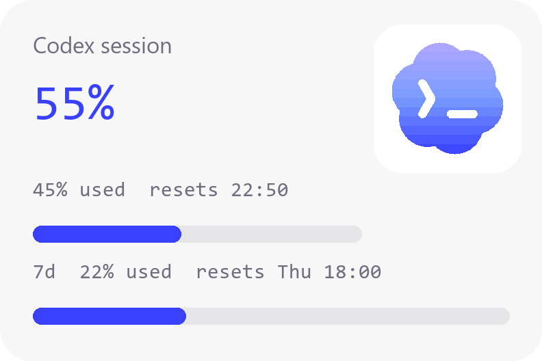

# Codex Session Widget

A tiny floating **Windows 11** desktop widget that shows your **OpenAI Codex
5-hour usage window**: the real % quota remaining, a live reset countdown, and
a weekly usage bar — on your desktop at all times.

- Big number: **% quota remaining** (real server-side figure from Codex transcripts)
- Sub-line: `% used  resets HH:MM` — real usage + reset time
- Progress bar = % used (blue Codex under 50%, amber through 80%, red above)
- Optional weekly usage bar (right-click → Show weekly usage)
- Minimises to the **system tray** — close the widget and it lives in your
  taskbar notification area; click the tray icon to bring it back
- Tray tooltip shows the live % remaining
- The real Codex logo (sparkle/bloom with the `>_` prompt, purple→blue gradient)
- No network calls, no credentials read, no telemetry



## Requirements

- **Windows 11** (10 also works)
- **Python 3.10+** with Tkinter (`python.org` installer includes it; check
  "Add python to PATH")
- A **ChatGPT Plus/Pro** subscription used via **Codex** (CLI or desktop app)

## Install

```powershell
cd codex-session-widget
powershell -NoProfile -ExecutionPolicy Bypass -File .\install.ps1
```

That copies the widget to `%LOCALAPPDATA%\CodexSessionWidget` and creates a
shortcut in your **Startup** folder so it starts at login. **No admin, nothing
system-wide.**

Uninstall any time:

```powershell
powershell -NoProfile -ExecutionPolicy Bypass -File .\uninstall.ps1
```

Run it once now without installing:

```powershell
pythonw SessionWidget.py
```

## How it works

The widget reads **real usage data** from your local Codex transcripts — no
network, no credentials.

### Where the numbers come from

Codex writes session transcripts to `~/.codex/sessions/YYYY/MM/DD/rollout-*.jsonl`.
Each file is a JSONL log of events. Among the event types, `token_count` events
carry a `rate_limits` payload that Codex itself receives from OpenAI's servers:

```json
{
  "type": "event_msg",
  "payload": {
    "type": "token_count",
    "rate_limits": {
      "primary": {
        "used_percent": 45.0,
        "window_minutes": 300,
        "resets_at": 1781699187
      },
      "secondary": {
        "used_percent": 22.0,
        "window_minutes": 10080,
        "resets_at": 1782062642
      },
      "plan_type": "plus"
    }
  }
}
```

- **`primary`** = the 5-hour rolling window (300 min). `used_percent` is the
  real server-side % — the same number ChatGPT/Codex shows in its UI.
- **`secondary`** = the 7-day weekly window (10080 min).
- `resets_at` is a Unix timestamp.

The widget scans all transcripts from the last 36h, finds the most recent
`rate_limits` event, and displays:
- **Big number**: `100 - used_percent` = % remaining
- **Sub-line**: `used_percent% used  resets HH:MM`
- **Bar**: filled to `used_percent / 100`
- **Weekly bar** (optional): `secondary.used_percent`

If no `rate_limits` event exists (e.g. before Codex's first run), it falls back
to a transcript-timestamp reconstruction flagged `est`.

### System tray

When you close the widget (right-click → **Hide to tray**, or the window's
close action), it withdraws from the desktop and lives as an icon in the
Windows notification area (system tray). The tray tooltip shows the live %
remaining. Left-click the tray icon to show the widget again; right-click for
a menu with **Show widget** and **Quit**.

The tray is implemented with raw Win32 `Shell_NotifyIconW` via `ctypes` — no
external dependency, stdlib only.

## Files

| file | what it is |
|---|---|
| `SessionWidget.py` | the widget (Python stdlib + Tkinter + ctypes, no dependencies) |
| `install.ps1` / `uninstall.ps1` | per-user startup-shortcut setup / teardown |
| `build.ps1` | renders a PNG snapshot for the README (uses Pillow) |

State: `~/.codex/widget-state.json` (position + weekly toggle).
Data source: `~/.codex/sessions/YYYY/MM/DD/rollout-*.jsonl` (events with
`rate_limits`).
Logs: none (it's silent — read the source, it's ~900 lines).

## Notes / FAQ

- **Is the % accurate?** Yes — it's the real server-side figure from Codex's own
  `token_count`/`rate_limits` events. It matches what Codex shows in its UI.
  The only caveat: it updates when Codex writes a new transcript event, so there
  can be a short lag (seconds) after you stop using Codex.
- **It says "Idle" but I'm using Codex?** A new session's first `token_count`
  event may take a few seconds to appear. Right-click → Refresh now, or wait
  up to a minute.
- **Where's the tray icon?** In the Windows notification area (bottom-right,
  near the clock). If it's in the overflow, click the `^` arrow to find it.
- **DPI?** It auto-scales to your display scale (per-monitor v2 awareness on
  Windows 11).
- **No poller?** No need — Codex writes the real % directly to transcripts.
  No network calls, ever.

## Origin

Forked from the [Claude Session Widget](https://github.com/...) for macOS
(Swift/AppKit) — re-implemented for Windows 11 + OpenAI Codex in Python/Tkinter.

Free to use and modify for personal or non-commercial purposes (PolyForm
NonCommercial 1.0.0 — see LICENSE). Built by a Codex user for Codex users — not
affiliated with OpenAI.
